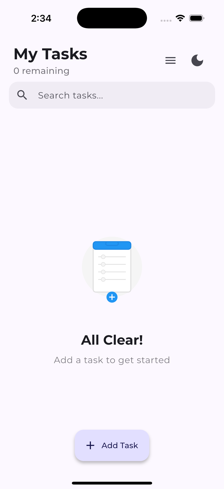
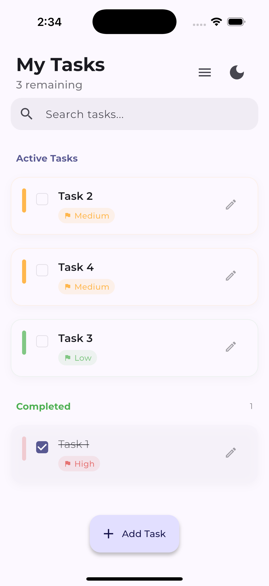
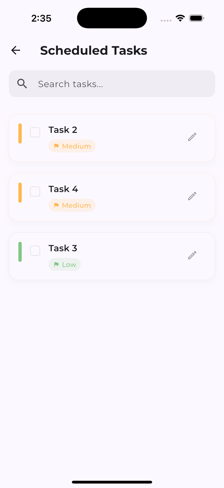
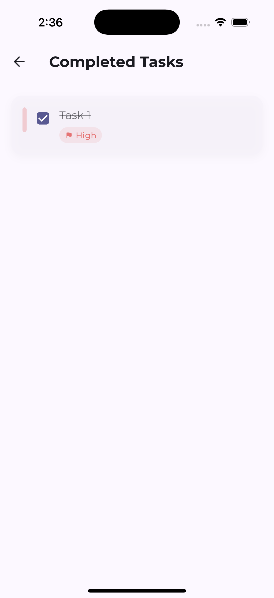
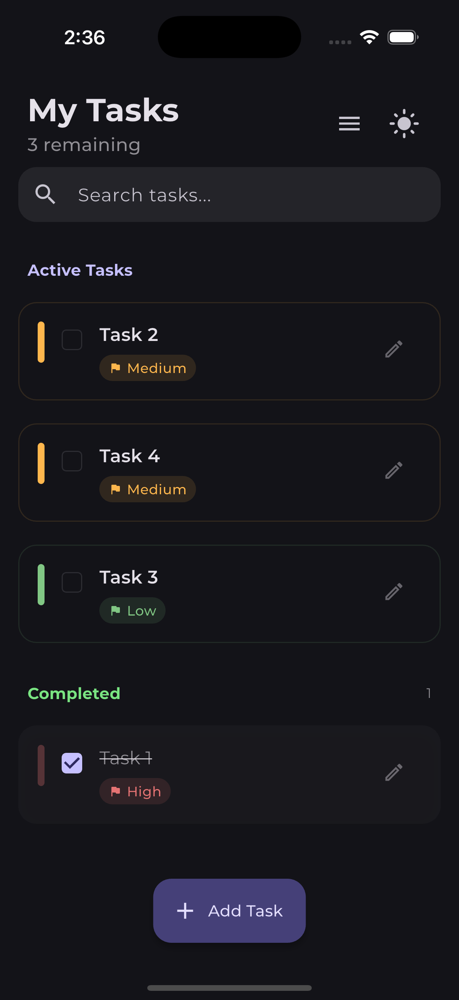
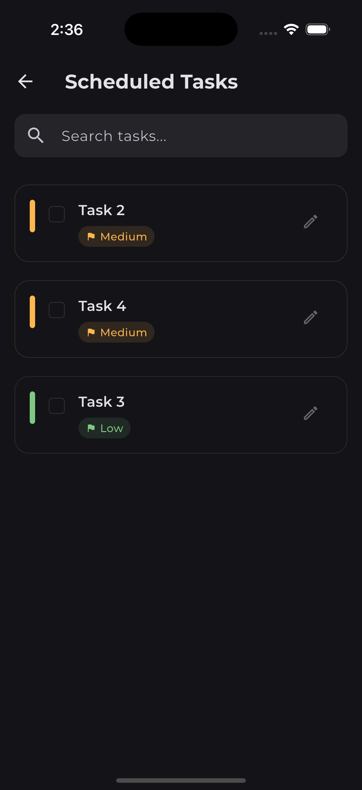
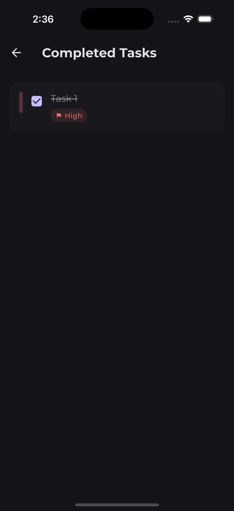

# BlueTick - Simple Todo App

<p align="center">
  
</p>

A clean, modern todo app built with Flutter featuring an intuitive UI, dark mode support, and smooth animations.

## 📱 Screenshots

<div style="display: flex; flex-wrap: wrap; gap: 10px; justify-content: center">
  
  
  
  
  
  
  
</div>

## ✨ Features

- **Task Management**: Add, complete, and delete tasks with ease.
- **Dark Mode**: Toggle between light and dark themes.
- **Animated UI**: Smooth transitions and animations.
- **Local Storage**: Tasks persist between app launches.
- **Gesture Support**: Swipe to delete tasks.
- **Empty State**: Clean interface when no tasks exist.
- **Task Categories**: Separate sections for active and completed tasks.
- **Responsive Design**: Works across various screen sizes.

## 🚀 Getting Started

### Prerequisites

- Flutter (2.0 or newer)
- Dart SDK
- Android Studio or VS Code with Flutter extensions

### Installation

1. Clone the repository:

   ```bash
   git clone https://github.com/ramynabilmahmoud/bluetick.git
   ```

2. Navigate to the project directory:

   ```bash
   cd bluetick
   ```

3. Install dependencies:

   ```bash
   flutter pub get
   ```

4. Run the app:

   ```bash
   flutter run
   ```

## 🎨 Customization

BlueTick supports extensive customization through the settings menu:

- Change accent colors
- Configure notification preferences
- Customize task categories

Here's the corrected section of the README file based on your provided updates:

---

Here's the updated section of the README file reflecting the use of **Stateful Widgets** for state management:

---

## 🔄 State Management

The app utilizes **Stateful Widgets** for state management, ensuring smooth performance even with numerous tasks.

## 💾 Storage

Tasks are stored locally using **SharedPreferences**, a simple key-value storage solution for Flutter.

## 🛠️ Technologies Used

- Flutter
- Dart
- **Stateful Widgets** (State Management)
- **SharedPreferences** (Local Storage)

## 📃 License

This project is licensed under the MIT License - see the LICENSE file for details.
